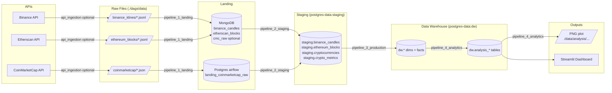
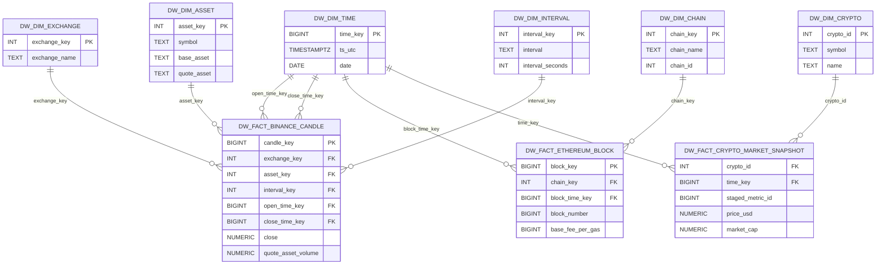

# Blockchain Exchange Data Platform


A comprehensive data engineering platform for collecting, processing, and analyzing blockchain and cryptocurrency market data using modern data pipeline architectures.

## 📊 Project Overview

This project implements a complete data platform that ingests, processes, and analyzes cryptocurrency and blockchain data from multiple sources:

- **Off-chain Market Data**: Trading data and candlestick charts from Binance
- **On-chain Network Data**: Ethereum blockchain data via Etherscan API
- **Market Snapshots**: Real-time cryptocurrency metrics from CoinMarketCap

The platform follows a **medallion architecture** with 4 automated Airflow pipelines that transform raw data through landing, staging, data warehouse, and analytics layers.

## 🏗️ Architecture

### Technology Stack

| Layer | Technology | Purpose |
|-------|-----------|---------|
| **Orchestration** | Apache Airflow | Workflow scheduling and monitoring |
| **Landing Zone** | MongoDB | Raw data storage (Binance, Ethereum) |
| **Landing Zone** | PostgreSQL | Raw data storage (CoinMarketCap) |
| **Staging** | PostgreSQL | Data cleaning and validation |
| **Data Warehouse** | PostgreSQL | Star schema with dimensions and facts |
| **Analytics** | PostgreSQL + Python | Analysis queries and visualizations |
| **Visualization** | Streamlit | Interactive dashboard |
| **Management** | pgAdmin, Mongo Express | Database administration |
| **Containerization** | Docker Compose | Local development environment |

### Data Zones

The platform implements a multi-layered data architecture:

#### 1. **Raw Data Files**
- Location: `./dags/data/...` (mounted to `/opt/airflow/dags/data/...` in containers)
- Format: JSON/JSONL files partitioned by date
- Sources: Binance klines, Ethereum blocks, CoinMarketCap snapshots

#### 2. **Landing Zone**
- **MongoDB** (`blockchain` database):
  - `binance_candles`: Raw candlestick data
  - `etherscan_blocks`: Raw Ethereum block data
  - `coinmarketcap_raw` (optional): Raw market snapshots
- **PostgreSQL** (Airflow database):
  - `public.landing_coinmarketcap_raw`: CoinMarketCap landing table

#### 3. **Staging Zone**
- **PostgreSQL** (`postgres-data` database, `staging` schema):
  - `staging.binance_candles`: Cleaned trading data
  - `staging.ethereum_blocks`: Validated blockchain data
  - `staging.cryptocurrencies`: Cryptocurrency master data
  - `staging.crypto_metrics`: Market metrics

#### 4. **Data Warehouse**
- **PostgreSQL** (`postgres-data` database, `dw` schema):

  **Dimension Tables:**
  - `dw.dim_time`: Time dimension
  - `dw.dim_exchange`: Exchange master data (Binance, etc.)
  - `dw.dim_asset`: Trading pair information
  - `dw.dim_interval`: Candlestick interval metadata
  - `dw.dim_chain`: Blockchain network data
  - `dw.dim_crypto`: Cryptocurrency metadata

  **Fact Tables:**
  - `dw.fact_binance_candle`: Trading metrics
  - `dw.fact_ethereum_block`: Blockchain metrics
  - `dw.fact_crypto_market_snapshot`: Market snapshots

#### 5. **Analytics Layer**
- **PostgreSQL** (`dw` schema):
  - `dw.analysis_eth_price_vs_gas_fee_hourly`: ETH price vs. gas fee correlation (hourly)
  - `dw.analysis_eth_price_vs_gas_fee_summary`: Aggregated analysis
  - `dw.analysis_coinmarketcap_top_assets`: Top cryptocurrencies by market cap
  - `dw.analysis_integrated_daily`: Daily integrated metrics
- **Plot Outputs**: PNG visualizations in `./data/analysis/...`

## 🔄 Data Pipeline

### Pipeline Overview

The platform consists of 4 automated Airflow DAGs that process data through the medallion architecture:

| Pipeline | Purpose | Trigger | Schedule | Output |
|----------|---------|---------|----------|--------|
| **api_ingestion** | Fetch data from APIs → raw files | Manual/Cron | `* * * * *` (paused by default) | Files in `./dags/data/...` |
| **pipeline_1_landing** | Load raw files → Landing databases | Dataset | Every 15 min (`*/15 * * * *`) | MongoDB collections + Landing tables |
| **pipeline_2_staging** | Clean & validate Landing → Staging | Dataset | When `LANDING_DATASET` updated | `staging.*` tables |
| **pipeline_3_production** | Transform Staging → Data Warehouse | Dataset | When `STAGING_DATASET` updated | `dw.*` dimensions & facts |
| **pipeline_4_analytics** | Generate analytics & visualizations | Dataset | When `DW_DATASET` updated | `dw.analysis_*` + PNG plots |

### Dataset-Based Triggering

The pipelines use **Airflow Datasets** for automatic dependency management:
- `pipeline_1_landing` → triggers → `pipeline_2_staging` (via `LANDING_DATASET`)
- `pipeline_2_staging` → triggers → `pipeline_3_production` (via `STAGING_DATASET`)
- `pipeline_3_production` → triggers → `pipeline_4_analytics` (via `DW_DATASET`)

Datasets are defined in [`dags/pipeline_datasets.py`](dags/pipeline_datasets.py).

### Data Flow Diagram



### Data Warehouse Star Schema



## 🚀 Quick Start

### Prerequisites

- Docker Engine (20.10+)
- Docker Compose Plugin (2.0+)
- 4GB+ RAM available for containers

### Installation

1. **Clone the repository**
```bash
git clone <repository-url>
cd dataeng2025-blockchain-exchange
```

2. **Configure environment variables**

Create or verify the `.env` file with your configuration:
```bash
# Copy example if needed
cp .env.example .env
```

Key variables to set:
- Database credentials
- API keys (optional, for online ingestion)
- Port configurations

3. **Start the platform**
```bash
docker compose up -d
```

On first start, the `airflow-init` service will:
- Initialize the Airflow metadata database
- Create default admin user
- Set up Airflow variables

> **Note**: By default, `./data` ownership is not recursively changed (can be slow with large files). If you encounter permission issues, set `AIRFLOW_INIT_CHOWN_DATA=true` in `.env` and restart the init service.

4. **Verify services**

Wait 1-2 minutes for all services to start, then access:

| Service | URL | Credentials |
|---------|-----|-------------|
| **Airflow UI** | http://localhost:8080 | `airflow` / `airflow` |
| **Streamlit Dashboard** | http://localhost:8501 | - |
| **Mongo Express** | http://localhost:8081 | `admin` / `admin` |
| **pgAdmin** | http://localhost:${PGADMIN_PORT} | See `.env` |

Database connections:
- **PostgreSQL (Airflow)**: `localhost:5432`
- **PostgreSQL (Data)**: `localhost:5433`
- **MongoDB**: `localhost:27017`

## 📥 Data Ingestion

### Option 1: Offline Mode (Sample Data)

Use the included sample data for testing without API keys:

1. Sample files are located in `./dags/data/`:
   - `./dags/data/binance_klines/**/*.jsonl`
   - `./dags/data/ethereum_blocks/**/*.jsonl`
   - `./dags/data/coinmarketcap/**/*.json`

2. Enable `pipeline_1_landing` in Airflow UI (it's enabled by default)

3. The pipeline will scan all files recursively and load them into the landing zone

**Partition Mode** (optional):
- Set Airflow Variable `LANDING_ONLY_DS_PARTITION=true` to only load files from `./dags/data/<source>/<ds>/...` (where `<ds>` is the execution date)

### Option 2: Online Mode (Live API Data)

To fetch real-time data from APIs:

1. **Set API keys** in Airflow Variables or `.env`:
   ```bash
   ETHERSCAN_API_KEY=your_etherscan_key
   COINMARKETCAP_API_KEY=your_coinmarketcap_key
   ```

   > Binance API works without authentication for public endpoints

2. **Configure data sources** (optional):
   - `BINANCE_SYMBOLS`: Trading pairs to fetch (default: `BTCUSDT,ETHUSDT`)
   - `BINANCE_INTERVAL`: Candlestick interval (default: `1m`)
   - `BINANCE_LIMIT`: Number of candles per request (default: `1000`)

3. **Enable API ingestion**:
   - Go to Airflow UI → DAGs
   - Unpause `api_ingestion` DAG
   - The DAG runs every minute and uses checkpoints to track progress

## 📊 Analytics & Dashboard

### Streamlit Dashboard

The Streamlit dashboard visualizes key metrics:
- ETH price vs. gas fee correlation
- Hourly and daily aggregations
- Top cryptocurrencies by market cap

Access at: http://localhost:8501

### Analysis Pipeline

`pipeline_4_analytics` generates:
1. **Correlation analysis**: ETH price vs. network gas fees
2. **Aggregation tables**: Daily/hourly summaries
3. **Visualizations**: PNG plots saved to `./data/analysis/`

Analysis configuration (Airflow Variables):
- `ANALYSIS_LOOKBACK_DAYS`: Historical period to analyze
- `ANALYSIS_ASSET_SYMBOL`: Asset to analyze (default: `ETHUSDT`)
- `ANALYSIS_BINANCE_INTERVAL`: Interval for analysis
- `ANALYSIS_OUTPUT_DIR`: Output directory for plots

## ⚙️ Configuration

### Key Airflow Variables

The DAGs use sensible defaults matching `compose.yml`. Most commonly modified variables:

**MongoDB Configuration:**
- `MONGO_URI`: MongoDB connection string
- `MONGO_DB`: Database name (default: `blockchain`)
- `BINANCE_MONGO_COLLECTION`: Collection for Binance data
- `ETHERSCAN_MONGO_COLLECTION`: Collection for Ethereum data
- `COINMARKETCAP_TO_MONGO`: Store CMC in MongoDB (default: `false`)

**PostgreSQL - Landing:**
- `LANDING_PG_HOST`, `LANDING_PG_PORT`, `LANDING_PG_DB`
- `LANDING_PG_USER`, `LANDING_PG_PASSWORD`

**PostgreSQL - Staging:**
- `STAGING_PG_HOST`, `STAGING_PG_PORT`, `STAGING_PG_DB`
- `STAGING_PG_USER`, `STAGING_PG_PASSWORD`

**PostgreSQL - Data Warehouse:**
- `DW_PG_HOST`, `DW_PG_PORT`, `DW_PG_DB`
- `DW_PG_USER`, `DW_PG_PASSWORD`

**Data Cleanup (optional):**
- `BINANCE_DELETE_AFTER_LOAD`: Delete raw files after loading
- `ETHERSCAN_DELETE_AFTER_LOAD`: Delete raw files after loading
- `COINMARKETCAP_DELETE_AFTER_LOAD`: Delete raw files after loading

### Environment Variables (.env)

See [`.env`](.env) for all configurable options including:
- Service ports
- Database credentials
- Airflow configuration
- API keys

## 📁 Repository Structure

```
.
├── compose.yml                 # Docker Compose configuration
├── .env                        # Environment variables
├── dags/                       # Airflow DAGs
│   ├── api_ingestion.py       # Optional API data fetcher
│   ├── pipeline_1_landing.py  # Raw files → Landing DBs
│   ├── pipeline_2_staging.py  # Landing → Staging (cleaning)
│   ├── pipeline_3_production.py # Staging → Data Warehouse
│   ├── pipeline_4_analytics.py  # Analytics & visualizations
│   ├── pipeline_datasets.py   # Dataset definitions
│   └── data/                  # Raw data files
│       ├── binance_klines/
│       ├── ethereum_blocks/
│       └── coinmarketcap/
├── dashboard/                  # Streamlit dashboard
│   ├── app.py
│   └── utils.py
├── data/                       # Analysis outputs
│   └── analysis/
├── sql/                        # SQL queries and examples
│   └── analysis_queries.sql
└── README.md                   # This file
```

## 🔧 Development & Troubleshooting

### Common Issues

**Permission errors on `./data` directory:**
- Set `AIRFLOW_INIT_CHOWN_DATA=true` in `.env`
- Restart: `docker compose down && docker compose up -d`

**Pipeline not triggering:**
- Check Airflow UI → Datasets to see if datasets are being updated
- Verify previous pipeline completed successfully
- Check Airflow logs for errors

**MongoDB connection errors:**
- Verify MongoDB is running: `docker compose ps`
- Check connection string in Airflow Variables
- Review MongoDB logs: `docker compose logs mongodb`

### Monitoring

**Airflow UI:**
- DAG runs and task status
- Logs for each task
- Dataset lineage graph

**Database Management:**
- **pgAdmin**: Visual PostgreSQL management
- **Mongo Express**: MongoDB document viewer

### Cleanup

Stop and remove all containers:
```bash
docker compose down
```

Remove all data (⚠️ destructive):
```bash
docker compose down -v
rm -rf ./data ./dags/data
```

## 📚 Additional Resources

### Data Sources

- **Binance API**: https://binance-docs.github.io/apidocs/spot/en/
- **Etherscan API**: https://docs.etherscan.io/
- **CoinMarketCap API**: https://coinmarketcap.com/api/

### Technologies

- **Apache Airflow**: https://airflow.apache.org/
- **MongoDB**: https://docs.mongodb.com/
- **PostgreSQL**: https://www.postgresql.org/docs/
- **Streamlit**: https://docs.streamlit.io/

## 📋 Course Requirements

This project fulfills the requirements from the Data Engineering course at INSA:
- ✅ Repository with complete code and documentation
- ✅ `docker-compose` setup for easy deployment
- ✅ Detailed architecture description and pipeline documentation
- ✅ Comprehensive README with design decisions and setup guide
- ✅ Sample dataset for offline testing
- ✅ Automated data pipelines with proper orchestration

Course information: https://www.riccardotommasini.com/courses/dataeng-insa-ot/

## 📄 License

This project is part of an academic assignment at INSA.

## 👥 Contributors

- Data Engineering Course - INSA
- Course Instructor: Prof. Riccardo Tommasini

---

**Built with ❤️ using Apache Airflow, PostgreSQL, MongoDB, and Streamlit**
