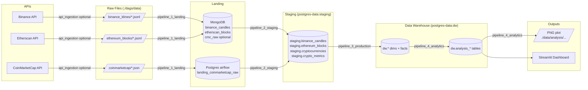
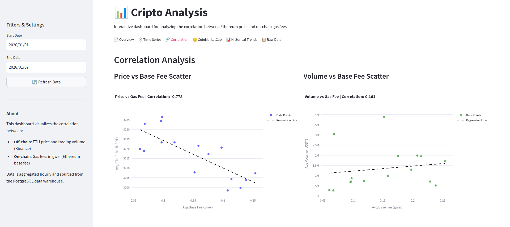

# Blockflow


## Abstract

This project implements an ETL pipeline for cryptocurrency and blockchain data analysis. The system ingests off-chain trading data from Binance, on-chain network metrics from Ethereum via Etherscan, and market snapshots from CoinMarketCap. Data flows through a medallion architecture with four transformation layers: landing (MongoDB/PostgreSQL), staging (PostgreSQL), data warehouse (PostgreSQL star schema), and analytics (aggregations and visualizations(streamlit and redis)). Apache Airflow orchestrates the pipeline using dataset-based dependencies for automatic triggering. The implementation demonstrates practical application of NoSQL document storage for semi-structured data ingestion, relational databases for structured analytics, and dimensional modeling for query optimization.

## Table of Contents

- [Project Overview](#project-overview)
- [Architecture](#architecture)
  - [Design Decisions](#design-decisions)
  - [Technology Stack](#technology-stack)
  - [Data Zones](#data-zones)
- [Data Pipeline](#data-pipeline)
  - [Pipeline Overview](#pipeline-overview)
  - [Dataset-Based Triggering](#dataset-based-triggering)
  - [Data Flow Diagram](#data-flow-diagram)
  - [Data Warehouse Star Schema](#data-warehouse-star-schema)
- [Quick Start](#quick-start)
  - [Prerequisites](#prerequisites)
  - [Installation](#installation)
- [Data Ingestion](#data-ingestion)
- [Analytics & Dashboard](#analytics--dashboard)
  - [Research Questions](#research-questions)
  - [Results](#results)
- [Configuration](#configuration)
- [Repository Structure](#repository-structure)
- [Development & Troubleshooting](#development--troubleshooting)
- [Additional Resources](#additional-resources)
- [License](#license)
- [Contributors](#contributors)

## Project Overview

This platform processes cryptocurrency and blockchain data from three primary sources:

- **Off-chain Market Data**: Trading data and candlestick charts from Binance API
- **On-chain Network Data**: Ethereum blockchain metrics via Etherscan API
- **Market Snapshots**: Cryptocurrency market metrics from CoinMarketCap API

The architecture implements four automated Airflow pipelines that transform raw data through landing, staging, data warehouse, and analytics layers.

## Architecture

### Design Decisions

**Redis as Message Broker**

Redis serves as the message broker for Airflow's CeleryExecutor, managing the task queue and distributing workload across multiple worker nodes. This architecture enables horizontal scaling and parallel task execution.

**MongoDB for Semi-Structured Data**

MongoDB handles the landing zone for Binance trading data and Ethereum blockchain data. These data sources deliver nested JSON structures with variable schemas that map naturally to document storage. MongoDB's flexible schema accommodates API response variations without requiring migration scripts, which is particularly valuable during the landing phase when data structure exploration is ongoing.

**PostgreSQL for Structured Analytics**

PostgreSQL manages three distinct layers:
- **Airflow Metadata**: DAG execution history, task states, and configuration
- **Staging Zone**: Cleaned and validated tabular data with enforced schemas
- **Data Warehouse**: Star schema implementation for analytical workloads

The transition from MongoDB (landing) to PostgreSQL (staging/warehouse) reflects the progression from exploratory data ingestion to structured analytical processing.

**Star Schema Design**

The data warehouse implements a star schema with dimension tables (time, exchange, asset, chain, crypto) and fact tables (candles, blocks, market snapshots). This denormalized structure optimizes query performance for analytical workloads by minimizing joins and enabling efficient aggregations. The schema supports common analytical patterns like time-series analysis and multi-dimensional slicing without requiring complex joins across normalized tables.

### Technology Stack

| Layer | Technology | Purpose |
|-------|-----------|---------|
| **Orchestration** | Apache Airflow | Workflow scheduling and monitoring |
| **Cache** | Redis | Analysis result caching |
| **Landing Zone** | MongoDB | Raw data storage (Binance, Ethereum) |
| **Landing Zone** | PostgreSQL | Raw data storage (CoinMarketCap) |
| **Staging** | PostgreSQL | Data cleaning and validation |
| **Data Warehouse** | PostgreSQL | Star schema with dimensions and facts |
| **Analytics** | PostgreSQL + Python | Analysis queries and visualizations |
| **Visualization** | Streamlit | Interactive dashboard |
| **Management** | pgAdmin, Mongo Express | Database administration |
| **Containerization** | Docker Compose | Local development environment |

### Data Zones

The platform implements a multi-layered architecture:

#### 1. **Raw Data Files**
- Location: `./dags/data/...` (mounted to `/opt/airflow/dags/data/...` in containers)
- Format: JSON/JSONL files partitioned by date
- Sources: Binance klines, Ethereum blocks, CoinMarketCap snapshots

#### 2. **Landing Zone**
- **MongoDB** (`blockchain` database):
  - `binance_candles`: Raw candlestick data
  - `etherscan_blocks`: Raw Ethereum block data
  - `coinmarketcap_raw` (optional): Raw market snapshots
- **PostgreSQL** (Airflow database):
  - `public.landing_coinmarketcap_raw`: CoinMarketCap landing table

#### 3. **Staging Zone**
- **PostgreSQL** (`postgres-data` database, `staging` schema):
  - `staging.binance_candles`: Cleaned trading data
  - `staging.ethereum_blocks`: Validated blockchain data
  - `staging.cryptocurrencies`: Cryptocurrency master data
  - `staging.crypto_metrics`: Market metrics

#### 4. **Data Warehouse**
- **PostgreSQL** (`postgres-data` database, `dw` schema):

  **Dimension Tables:**
  - `dw.dim_time`: Time dimension
  - `dw.dim_exchange`: Exchange master data (Binance, etc.)
  - `dw.dim_asset`: Trading pair information
  - `dw.dim_interval`: Candlestick interval metadata
  - `dw.dim_chain`: Blockchain network data
  - `dw.dim_crypto`: Cryptocurrency metadata

  **Fact Tables:**
  - `dw.fact_binance_candle`: Trading metrics
  - `dw.fact_ethereum_block`: Blockchain metrics
  - `dw.fact_crypto_market_snapshot`: Market snapshots

#### 5. **Analytics Layer**
- **PostgreSQL** (`dw` schema):
  - `dw.analysis_eth_price_vs_gas_fee_hourly`: ETH price vs. gas fee correlation (hourly)
  - `dw.analysis_eth_price_vs_gas_fee_summary`: Aggregated analysis
  - `dw.analysis_coinmarketcap_top_assets`: Top cryptocurrencies by market cap
  - `dw.analysis_integrated_daily`: Daily integrated metrics
- **Plot Outputs**: PNG visualizations in `./data/analysis/...`

## Data Pipeline

### Pipeline Overview

Four automated Airflow DAGs process data through the medallion architecture:

| Pipeline | Purpose | Trigger | Schedule | Output |
|----------|---------|---------|----------|--------|
| **api_ingestion** | Fetch data from APIs → raw files | Manual/Cron | `* * * * *` (paused by default) | Files in `./dags/data/...` |
| **pipeline_1_landing** | Load raw files → Landing databases | Dataset | Every 15 min (`*/15 * * * *`) | MongoDB collections + Landing tables |
| **pipeline_2_staging** | Clean & validate Landing → Staging | Dataset | When `LANDING_DATASET` updated | `staging.*` tables |
| **pipeline_3_production** | Transform Staging → Data Warehouse | Dataset | When `STAGING_DATASET` updated | `dw.*` dimensions & facts |
| **pipeline_4_analytics** | Generate analytics & visualizations | Dataset | When `DW_DATASET` updated | `dw.analysis_*` + PNG plots |

### Dataset-Based Triggering

Pipelines use Airflow Datasets for dependency management:
- `pipeline_1_landing` triggers `pipeline_2_staging` via `LANDING_DATASET`
- `pipeline_2_staging` triggers `pipeline_3_production` via `STAGING_DATASET`
- `pipeline_3_production` triggers `pipeline_4_analytics` via `DW_DATASET`

Dataset definitions are located in [dags/pipeline_datasets.py](dags/pipeline_datasets.py).

### Data Flow Diagram



### Data Warehouse Star Schema


## Quick Start

### Prerequisites

- Docker Engine (20.10+)
- Docker Compose Plugin (2.0+)
- 4GB+ RAM available for containers

### Installation

1. **Clone the repository**
```bash
git clone https://github.com/Janispe/dataeng2025-blockchain-exchange
cd dataeng2025-blockchain-exchange
```

2. **Configure environment variables**

Configure database credentials, API keys (optional), and port settings.

3. **Start the platform**
```bash
docker compose up -d
```

The `airflow-init` service initializes the Airflow metadata database, creates the default admin user, and configures Airflow variables on first startup.

**Note**: Directory ownership for `./data` is not recursively changed by default. If permission issues occur, set `AIRFLOW_INIT_CHOWN_DATA=true` in `.env` and restart the init service.

4. **Verify services**

After 1-2 minutes, services are accessible at:

| Service | URL | Credentials |
|---------|-----|-------------|
| **Airflow UI** | http://localhost:8080 | `airflow` / `airflow` |
| **Streamlit Dashboard** | http://localhost:8501 | - |
| **Mongo Express** | http://localhost:8081 | `admin` / `admin` |
| **pgAdmin** | http://localhost:${PGADMIN_PORT} | See `.env` |

Database connections:
- **PostgreSQL (Airflow)**: `localhost:5432`
- **PostgreSQL (Data)**: `localhost:5433`
- **MongoDB**: `localhost:27017`

### Reproducibility Notes

The pipelines are connected via Airflow Datasets, so downstream DAGs trigger automatically once new data lands:

- The chain only starts when at least one data source produces input (offline: sample files exist in `./dags/data/...`; online: enable `api_ingestion` or provide files).
- `pipeline_1_landing` runs every 15 minutes by default, so allow a short delay or manually trigger it once in the Airflow UI to start the chain immediately.

## Data Ingestion

### Option 1: Offline Mode (Sample Data)

The platform includes sample data for testing without API credentials. Sample files are located in:
- `./dags/data/binance_klines/**/*.jsonl`
- `./dags/data/ethereum_blocks/**/*.jsonl`
- `./dags/data/coinmarketcap/**/*.json`

The `pipeline_1_landing` DAG is enabled by default and scans these directories recursively, loading all files into the landing zone.

**Partition Mode**: Set Airflow Variable `LANDING_ONLY_DS_PARTITION=true` to restrict loading to files from `./dags/data/<source>/<ds>/...` where `<ds>` matches the execution date.

### Option 2: Online Mode (Live API Data)

For real-time data ingestion, configure API credentials in Airflow Variables or `.env`:

```bash
ETHERSCAN_API_KEY=your_etherscan_key
COINMARKETCAP_API_KEY=your_coinmarketcap_key
```

Binance API public endpoints do not require authentication.

**Configuration** (optional):
- `BINANCE_SYMBOLS`: Trading pairs (default: `BTCUSDT,ETHUSDT`)
- `BINANCE_INTERVAL`: Candlestick interval (default: `1m`)
- `BINANCE_LIMIT`: Candles per request (default: `1000`)

Enable the `api_ingestion` DAG in the Airflow UI. The DAG executes every minute and maintains checkpoint state to track ingestion progress.

## Analytics & Dashboard

### Research Questions

The platform addresses three analytical questions:

1. **Does ETH price correlate with on-chain network activity?**
   Analyzes the relationship between off-chain market prices (Binance ETHUSDT) and on-chain gas fees (Ethereum base fee per gas). Strong correlation would suggest that price movements align with network congestion.

2. **Does trading volume correlate with blockchain gas fees?**
   Examines whether trading activity on centralized exchanges reflects on-chain network utilization. This investigates the connection between off-chain trading behavior and on-chain transaction demand.

3. **How do different data sources compare for the same asset?**
   Compares price data across CoinMarketCap and Binance, integrated with Ethereum network metrics. This validates data consistency across sources and enables multi-dimensional analysis.

### Results

Analysis of the January 2026 dataset reveals distinct correlation patterns:



**Price vs. Gas Fee Correlation: -0.778**

A strong negative correlation indicates that ETH price movements inversely correlate with network gas fees during the analyzed period. When prices increased, gas fees tended to decrease, suggesting that price appreciation periods may coincide with reduced on-chain transaction activity.

**Volume vs. Gas Fee Correlation: 0.161**

Weak positive correlation between trading volume and gas fees indicates limited relationship between centralized exchange activity and on-chain network congestion. This suggests that off-chain trading behavior does not directly reflect on-chain transaction demand.

**Data Source Comparison**

Price data from CoinMarketCap and Binance showed consistency across the analyzed period, validating the reliability of both data sources for ETH price metrics.

### Streamlit Dashboard

The dashboard visualizes correlation coefficients, time-series trends, scatter plots, and statistical summaries. Historical correlation tracking shows how relationships evolve over time. Access the interface at http://localhost:8501.

### Analysis Pipeline

The `pipeline_4_analytics` DAG produces correlation analysis between ETH price and network gas fees, daily and hourly aggregation tables, and PNG visualizations stored in `./data/analysis/`.

**Configuration** (Airflow Variables):
- `ANALYSIS_LOOKBACK_DAYS`: Historical analysis period
- `ANALYSIS_ASSET_SYMBOL`: Target asset (default: `ETHUSDT`)
- `ANALYSIS_BINANCE_INTERVAL`: Analysis interval
- `ANALYSIS_OUTPUT_DIR`: Plot output directory

## Configuration

### Key Airflow Variables

DAGs use default values matching `compose.yml`. Commonly modified variables include:

**MongoDB Configuration:**
- `MONGO_URI`: MongoDB connection string
- `MONGO_DB`: Database name (default: `blockchain`)
- `BINANCE_MONGO_COLLECTION`: Collection for Binance data
- `ETHERSCAN_MONGO_COLLECTION`: Collection for Ethereum data
- `COINMARKETCAP_TO_MONGO`: Store CMC in MongoDB (default: `false`)

**PostgreSQL - Landing:**
- `LANDING_PG_HOST`, `LANDING_PG_PORT`, `LANDING_PG_DB`
- `LANDING_PG_USER`, `LANDING_PG_PASSWORD`

**PostgreSQL - Staging:**
- `STAGING_PG_HOST`, `STAGING_PG_PORT`, `STAGING_PG_DB`
- `STAGING_PG_USER`, `STAGING_PG_PASSWORD`

**PostgreSQL - Data Warehouse:**
- `DW_PG_HOST`, `DW_PG_PORT`, `DW_PG_DB`
- `DW_PG_USER`, `DW_PG_PASSWORD`

**Data Cleanup (optional):**
- `BINANCE_DELETE_AFTER_LOAD`: Delete raw files after loading
- `ETHERSCAN_DELETE_AFTER_LOAD`: Delete raw files after loading
- `COINMARKETCAP_DELETE_AFTER_LOAD`: Delete raw files after loading

### Environment Variables

Configuration options in [.env](.env) include service ports, database credentials, Airflow settings, and API keys.

## Repository Structure

```
.
├── compose.yml                 # Docker Compose configuration
├── .env                        # Environment variables
├── dags/                       # Airflow DAGs
│   ├── api_ingestion.py       # Optional API data fetcher
│   ├── pipeline_1_landing.py  # Raw files → Landing DBs
│   ├── pipeline_2_staging.py  # Landing → Staging (cleaning)
│   ├── pipeline_3_production.py # Staging → Data Warehouse
│   ├── pipeline_4_analytics.py  # Analytics & visualizations
│   ├── pipeline_datasets.py   # Dataset definitions
│   └── data/                  # Raw data files
│       ├── binance_klines/
│       ├── ethereum_blocks/
│       └── coinmarketcap/
├── dashboard/                  # Streamlit dashboard
│   ├── app.py
│   └── utils.py
├── data/                       # Analysis outputs
│   └── analysis/
└── README.md                   # This file
```

## Development & Troubleshooting

### Common Issues

**Permission errors on `./data` directory:**
- Set `AIRFLOW_INIT_CHOWN_DATA=true` in `.env`
- Restart: `docker compose down && docker compose up -d`

**Pipeline not triggering:**
- Check Airflow UI → Datasets to see if datasets are being updated
- Verify previous pipeline completed successfully
- Check Airflow logs for errors

**MongoDB connection errors:**
- Verify MongoDB is running: `docker compose ps`
- Check connection string in Airflow Variables
- Review MongoDB logs: `docker compose logs mongodb`

### Monitoring

The Airflow UI provides DAG execution status, task logs, and dataset lineage visualization. Database administration interfaces include pgAdmin for PostgreSQL and Mongo Express for MongoDB.

### Cleanup

Stop and remove all containers:
```bash
docker compose down
```

Remove all data (destructive):
```bash
docker compose down -v
rm -rf ./data ./dags/data
```

## Additional Resources

### Data Sources

- **Binance API**: https://binance-docs.github.io/apidocs/spot/en/
- **Etherscan API**: https://docs.etherscan.io/
- **CoinMarketCap API**: https://coinmarketcap.com/api/

### Technologies

- **Apache Airflow**: https://airflow.apache.org/
- **MongoDB**: https://docs.mongodb.com/
- **PostgreSQL**: https://www.postgresql.org/docs/
- **Redis**: https://redis.io/docs/latest/
- **Streamlit**: https://docs.streamlit.io/

## License

This project is licensed under the terms of the license in [LICENSE](LICENSE).

## Contributors

Repository authors / contributors (add missing team members here):

- Janis Peters
- 
- 
